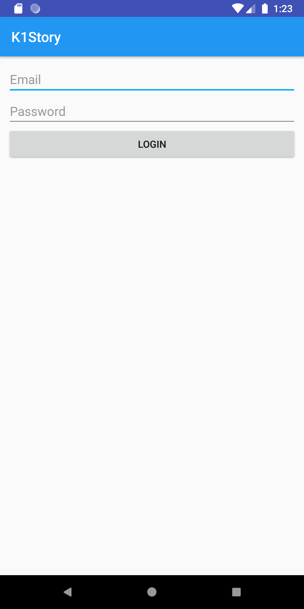
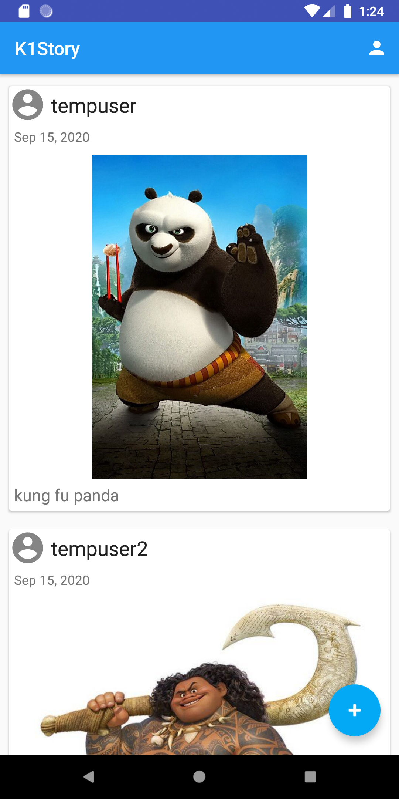
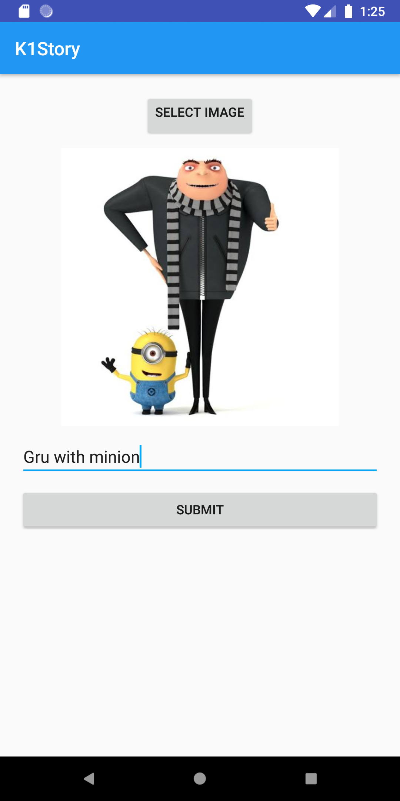

# K1Story_Creater
This Story Creater application allows user to share images along with description. 
This app uses Firebase Authentication for user login, Firestore for storing and syncing app data, and Storage for storing and retrieving images.

